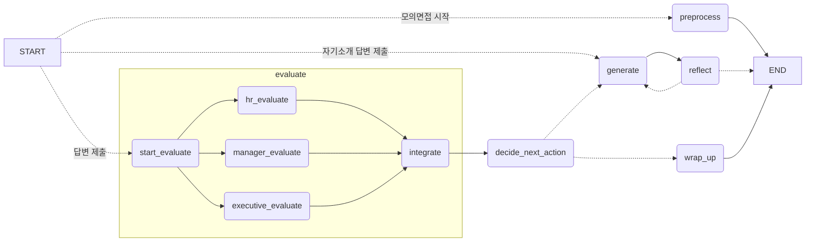

# Backend

FastAPI와 LangGraph로 구현한 AI 모의면접 서버입니다.

## 기술 스택

- **FastAPI**: REST API 및 SSE 스트리밍
- **LangGraph**: 에이전트 워크플로우
- **LangChain**: LLM 연동 (OpenAI GPT)
- **PostgreSQL**: 세션 데이터 및 LangGraph 체크포인트 저장

## 프로젝트 구조

```
backend/
├─ api/schema.py # API 요청/응답 스키마
├─ core/
│　 ├─ database.py # DB 연결 및 쿼리
│　 ├─ graph.py    # LangGraph 그래프 조립
│　 ├─ state.py    # 그래프 상태 정의
│　 ├─ nodes.py    # 그래프 노드 구현
│　 ├─ prompts.py  # LLM 프롬프트
│　 ├─ schema.py   # LLM 출력 스키마
│　 └─ utils.py
├─ data/categories.json # 질문 카테고리 정의
└─ main.py # FastAPI 앱 진입점
```

## 그래프 구조



### 노드 설명

| 노드               | 설명                                                              |
| ------------------ | ----------------------------------------------------------------- |
| preprocess         | PDF에서 텍스트 추출 후 LLM으로 키워드 추출 및 요약문 생성         |
| generate           | 이력서, 채용공고와 이전 대화 맥락을 바탕으로 면접 질문 생성       |
| reflect            | 생성된 질문을 검토하여 재생성 필요성 판단 (최대 3회)              |
| evaluate           | HR/실무/임원 면접관이 병렬로 답변 평가                            |
| integrate          | 병렬 평가 결과 통합                                               |
| decide_next_action | 답변 평가 점수를 기반으로 꼬리 질문 필요성 판단 및 다음 행동 결정 |
| wrap_up            | 전체 면접 기록을 바탕으로 종합 결과 보고서 생성                   |

## 실행 방법

먼저 `.env.example`을 참고해 `.env`를 생성해주세요.

```bash
cp .env.example .env
uv sync
uvicorn main:app --reload
```

서버가 실행되면 [http://localhost:8000/docs](http://localhost:8000/docs)에서 Swagger UI를 확인할 수 있습니다.

## API

| Method | Path                                  | 설명            |
| ------ | ------------------------------------- | --------------- |
| POST   | `/interview/start`                    | 모의면접 시작   |
| POST   | `/interview/answer`                   | 답변 제출 (SSE) |
| GET    | `/interview/messages?session_id={id}` | 대화 기록 조회  |
| GET    | `/interview/report?session_id={id}`   | 보고서 조회     |
| GET    | `/sessions`                           | 세션 목록 조회  |
